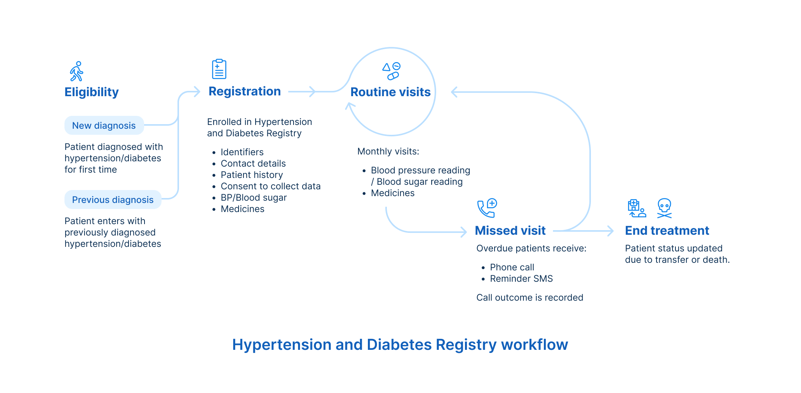
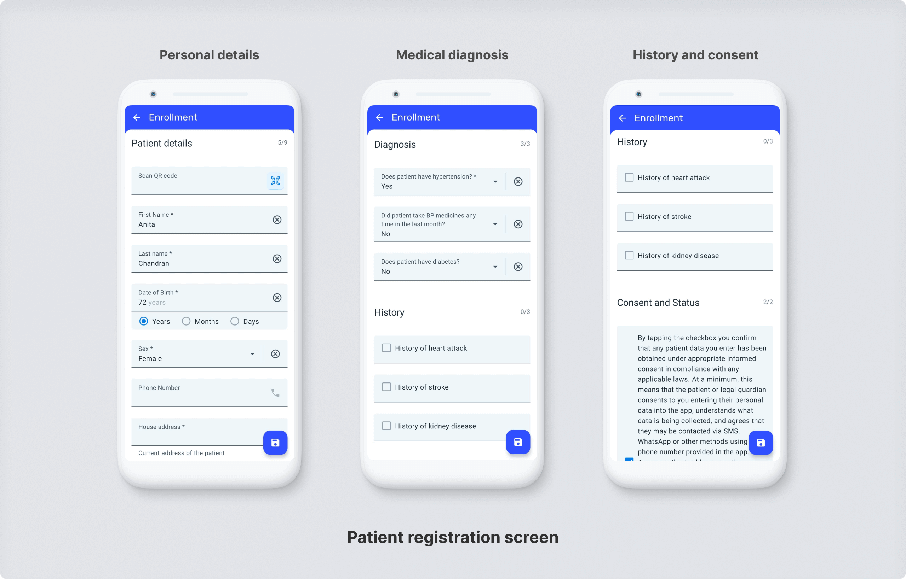

# Hypertension and Diabetes Registry System Design

## Introduction

### Purpose

This Hypertension and Diabetes Registry System Design Guide provides an overview of the reasoning and design used to configure a DHIS2 tracker program for registering and managing patients with hypertension and/or diabetes. This document is intended for use by DHIS2 implementers at country and regional level to support implementation and localization of the package. Local work flows and national guidelines should always be considered in the localization and adaptation of this configuration package.

### Background

Hypertension or elevated blood pressure is a serious medical condition that significantly increases the risks of diabetes, heart, brain, kidney, and other diseases. According to the WHO, an estimated 1.28 billion adults aged 30-79 years worldwide have hypertension, with two-thirds living in low- and middle-income countries. But only 1 in 5 adults with hypertension have their blood pressure under control1. Diabetes is another leading cause of death and disability, affecting 0.5 billion people worldwide, the majority in low- and middle-income countries2.

Given the high prevalence and co-morbidity of hypertension and diabetes, they are often treated together in primary care settings. Having a single digital tool to manage these patients is critical.

This Hypertension & Diabetes package is based on the DHIS2 Tracker program deployed in Nigeria since 2021, in collaboration with the Federal Ministry of Health Nigeria, National Primary Health Care Development Agency, HISP-Nigeria, WHO and Resolve to Save Lives. Indicators for the package were derived from the [WHO HEARTS Technical Package](https://www.who.int/publications/i/item/9789240001367) for hypertension management and WHO guidelines for diabetes.

As of May 2024, over 30,000 hypertensive and diabetes patients are being managed across 104 primary healthcare facilities with this DHIS2 Tracker program. The Nigeria program is based on the design of the [Simple App](https://www.simple.org/), a custom mobile application developed by RTSL, deployed in 4 countries, with 4 million patients enrolled for hypertension and diabetes care as of June 2024.

Before the [Nigeria Hypertension Control Initiative](https://www.afro.who.int/news/nigeria-collaborates-who-curb-hypertension-introduces-control-initiative) (NHCI), there were no tools to track the management of hypertension and diabetes patients, and only suspected cases were recorded in the national DHIS2 system. NHCI first introduced paper-based tools for tracking and monitoring these patients over time, but this approach had several issues. It increased workload and placed the burden on frontline healthcare workers. This caused data quality problems, such as inconsistencies, missing information, calculation errors, and delays in reporting. The result was that program managers and policymakers couldn’t get the accurate data they needed for decision-making. To address this, the DHIS2 Tracker was deployed across NHCI-supported facilities in Kano and Ogun states.

The key goal of this package is to collect accurate data at the right time, drive data-backed program improvements and scale hypertension management. And to do it while reducing the burden on health staff.

## System Design Overview

### Use Case

_Nigeria healthcare worker using DHIS2_

The main users of DHIS2 Capture app are care providers at primary health facilities who see patients for monthly hypertension and diabetes services. The dashboard is for health system managers and public health officers so they can analyse system performance and populations, often covering millions of people.

Since hypertension and diabetes affect a large proportion of the population, care providers typically have little time to enter detailed data on patient encounters. To address this, the system focuses on collecting a limited set of data elements to produce three key indicators:

- Percent of patients with controlled blood pressure/blood sugar: How many patients have visited recently with their blood pressure/blood sugar under control? This is the critical indicator to measure a successful hypertension and diabetes control program.
- Percent of patients with uncontrolled blood pressure/blood sugar: How many patients visited recently but their blood pressure/blood sugar is not controlled yet? These patients need to be treated successfully to bring their blood pressure/blood sugar under control.
- Percent of patients with missed monthly visits: How many patients are not regularly receiving care? These patients need to be encouraged to return to care.

These indicators can be monitored at the facility level or at higher district and national levels on dashboards (pictures below). Aggregate data can later be pushed into a national HMIS instance.

The system also supports patient management by collecting data like medication, helping clinicians manage prescribed medication to help patients control their BP and blood sugar.

Data entry can be done via a web browser or the [DHIS2 Tracker Android app](https://play.google.com/store/apps/details?id=com.dhis2&hl=en_IN). Since primary health care centres often lack reliable internet, the app is designed to work with offline data entry.

_Design Diagram_

### Rationale for program structure

Hypertension clinics get very busy. In India, a typical follow-up visit is 3 minutes. In Bangladesh, it’s 2 minutes. The fundamental goal of this program is to record blood pressure, blood sugar, medicines and schedule a follow-up visit REALLY FAST. This provides clinicians critical information to manage their patients, and generates key indicators for program managers to monitor the Hypertension and Diabetes program.

The data collected is only what’s needed to identify patients and manage hypertension/diabetes. But the Hypertension and Diabetes Registry can be expanded to cover other Non-Communicable diseases (NCDs) such as COPD. This is useful when other co-morbidities are also managed by the clinician during a Hypertension visit.

A significant challenge in managing chronic conditions like hypertension is ensuring patients return for regular check-ups and medication. The program has an overdue patient management component to bring overdue patients back to care.

## Program Configuration

### Registration

A new patient is enrolled into the Hypertension and Diabetes registry as a Tracked Entity Instance (TEI). For each TEI, the user will record Tracked Entity Attributes like name, date of birth etc. in the enrollment page to create the patient profile.

Seven fields are mandatory to enter during registration, noted with \*

- **Name:** The patient name (both **first name** and **last name**) is required as a potential identifier for the patient’s record over time
- **Date of birth**. If the patient does not know his or her date of birth, then the care provider should enter the patient’s age. Entering date of birth under 10 years old and over 140 years old displays an error. After entering the date of birth, the _current_ age is calculated as a program indicator and displayed in the indicators widget
- **District:** If the patient does not know their exact address, at a minimum the patient must provide the district the patient currently lives in. If not known, the care provider may use the district the health facility is located in
- **Does the patient have hypertension/diabetes?:** Only patients diagnosed with hypertension/diabetes should be registered in the program
- **Consent to record data**. The patient must give their consent to electronically record their personal data before saving the enrollment. This is noted with a mandatory yes-only tracked entity attribute.

QR codes that are stuck on patient appointment cards and recorded as a Tracked Entity Attribute can be used to easily search for a patient during a follow-up visit.

The history of cardiovascular and kidney disease for a patient is recorded to inform patient treatment.

NB. Since these demographic and identifier data are often reusable across tracker programs, the tracked entity attributes can be shared by multiple DHIS2 Tracker packages. Those metadata are found in the Common Metadata Library [Common Metadata Library](https://docs.dhis2.org/en/topics/metadata/dhis2-who-digital-health-data-toolkit/common-metadata-library/design.html) (and are prefixed with “GEN -” in the attribute name).

After the user clicks the _Save_ icon, the patient is considered enrolled in the Hypertension and Diabetes Registry, and the first Hypertension/Diabetes Visit event immediately opens.

### Hypertension & Diabetes Visit

The main stage in the program is the _Hypertension/Diabetes visit_ (HTN/DM visit). This stage is assumed to repeat every month after enrollment.

There is one mandatory and two optional sections in a visit:

1. **Hypertension record:** Systolic and diastolic blood pressure is recorded. Invalid blood pressure values (systolic reading of below 60 or above 260, diastolic reading of below 40 or above 260) are prohibited by program rules
2. **Diabetes record:** Type of blood sugar measure, unit and reading is recorded. The care provider can choose between random blood sugar, fasting blood sugar, post prandial blood sugar and HbA1c
3. **Medicines:** Captures the current hypertension and diabetes medication prescribed. Each implementation can customize the medication list based on their treatment protocol. Previously entered medication is listed in the program indicators widget and number of days since the most recent HTN visit.

_Enter HTN/DM visit details_

On completing the event data entry, the care provider will be asked to schedule a follow-up visit for the patient. This is defaulted to 28 days from the current visit date as patients commonly receive one month's supply of medication. If the patient receives medication for multiple months, the care provider can change the date of the follow-up visit accordingly.

### Calling report

This stage in the program is only visible for patients that are overdue (i.e. have missed a scheduled HTN/DM visit). The purpose of this stage is for care providers to call overdue patients and record the outcome of that call (i.e. whether a patient agrees to return to care, is not reachable or should be removed from the overdue list).

The care provider can view a line list of overdue patients using the pre-configured working lists. The care provider should sync with the backend to have up-to-date patient lists on their devices. Refer to the [installation guide](https://github.com/simpledotorg/dhis2-hypertension-package/blob/main/doc/installation_guide.md) for more info. Working lists in the app include:

- Overdue - 1. Pending to call: List of overdue patients that are yet to be called
- Overdue - 2. Agreed to visit: List of overdue patients that have been called and agreed to visit
- Overdue - 3. Remind to call later: List of overdue patients that were called but need a follow-up call (e.g. were busy, did not pick up)
- Overdue - 4. Remove from overdue list: List of overdue patients that were called and need to be removed from overdue list (full list of reasons available in metadata reference file)

NB. An overdue patient is no longer overdue only when they return to care for a HTN/DM visit

### Closing the record

If a patient is no longer being seen by the health facility, it is important to update the patient status, which will remove the patient’s record from the denominators of key performance indicators.

When calling overdue patients, the care provider may encounter individuals no longer expected at the health facility, whether due to death or transfer to another facility. To record this change in the program, in the calling report, the care provider can update the call outcome as ‘removed from overdue list’ and the corresponding reason (e.g. died, moved to private practitioner, transferred to another public health facility). A program rule will update the patient status and remove these patients from key performance indicators.

## Monthly summary form (aggregate reports)

At health facility level, the monthly summary form can be used to collect data on drug stock, medical device inventory and hypertension screening. At the end of each month, a care provider can record the number of adults screened for hypertension that month, the number of tablets of each medication remaining and functioning BP monitors.

_Enter monthly aggregate details_

## Dashboards

Two dashboards are included in this package, the _Hypertension_ and _Diabetes Dashboards_. These dashboards provide an overview of key indicators for hypertension and diabetes treatment outcomes. The dashboard can be viewed as a high-level program administrator user or at a local facility level.

Definitions for the dashboard indicators are closely based on definitions for reporting of [aggregate data from the Simple app](https://docs.simple.org/reports/what-we-report) as well as the [WHO HEARTS Technical Package](https://www.who.int/publications/i/item/9789240001367). The definitions are included below, and in a text box at the bottom of the dashboard.

Each dashboard is divided into the following sections:

### Treatment outcomes

![ref1]

_Dashboard - Treatment outcomes_

The first three charts display treatment outcomes related to blood pressure and blood sugar control of patients under care. Blood pressure and blood sugar control is the best indicator to know if patients under treatment are being treated effectively.

These three charts use data from the latest visit within the last three months, of patients registered more than 3 months ago.

**Why are patients registered within the last 3 months excluded?** Three months gives patients time to take their hypertension/diabetes medication and to get their blood pressure/blood sugar under control. Most newly registered patients have uncontrolled blood pressure and including them would not reflect an accurate picture of actual controlled patients.

The three charts within the treatment outcomes section are based on the following indicators:

| **Indicator**                        | **Hypertension dashboard**                                                                                                                                                                        | **Diabetes dashboard**                                                                                                                                                                                                         |
| :----------------------------------- | :------------------------------------------------------------------------------------------------------------------------------------------------------------------------------------------------ | :----------------------------------------------------------------------------------------------------------------------------------------------------------------------------------------------------------------------------- |
| % Patients controlled                | Patients under care in the hypertension control program (registered before the past 3 months) that visited a health facility in the past 3 months with a BP measure <140/90 at their latest visit | Patients under care in the diabetes control program (registered before the past 3 months) that visited a health facility in the past 3 months with controlled blood sugar (FBS < 126mg/dL or HbA1c <7%) at their latest visit  |
| % Patients uncontrolled              | Patients under care in the hypertension control program (registered before the past 3 months) that visited a health facility in the past 3 months with a BP measure ≥140/90 at their latest visit | Patients under care in the diabetes control program (registered before the past 3 months) that visited a health facility in the past 3 months with uncontrolled blood sugar (FBS ≥126mg/dL or HbA1c ≥7%) at their latest visit |
| % Patients no visit in past 3 months | Patients under care in the hypertension control program (registered before the past 3 months) with no visit (no BP measure recorded) in the past 3 months                                         | Patients under care in the diabetes control program (registered before the past 3 months) with no visit (no blood sugar recorded) in the past 3 months                                                                         |

### Registrations, patients under care, lost to follow-up and treatment cascade

![ref2]

_Dashboard - registrations, patients under care, lost to follow-up, treatment cascade_

The next section highlights registrations (how many patients are enrolled in a hypertension/diabetes control program) and how many of those patients are “under care” (have visited in the past 12 months). Patients that have not visited in the last 12 months (i.e. no BP measure/blood sugar recorded in the past 12 months) are recorded as lost to follow-up.

The treatment cascade (on right side) provides an estimated view of how many individuals in a region are under treatment for hypertension/diabetes and, of those patients, how many have their BP/blood sugar under control.

Figures shown include:

| **Indicator**                                    | **Hypertension dashboard**                                                                                                                                              | **Diabetes dashboard**                                                                                                                                                  |
| :----------------------------------------------- | :---------------------------------------------------------------------------------------------------------------------------------------------------------------------- | :---------------------------------------------------------------------------------------------------------------------------------------------------------------------- |
| **Registrations**                                |                                                                                                                                                                         |                                                                                                                                                                         |
| Patient registrations (Monthly)                  | New patients registered in the hypertension control program in a month                                                                                                  | New patients registered in the diabetes control program in a month                                                                                                      |
| 
Patient 

registrations (Cumulative)
 | Cumulative registrations in the hypertension control program (excluding dead patients)                                                                                  | Cumulative registrations in the diabetes control program (excluding dead patients)                                                                                      |
| Patients under care                              | Cumulative registrations in the hypertension control program excluding 12 month lost to follow-up and dead patients                                                     | Cumulative registrations in the diabetes control program excluding 12 month lost to follow-up and dead patients                                                         |
| **Lost to follow-up**                            |                                                                                                                                                                         |
| % 12 month lost to follow-up                     | Patients with no "visit" in the past 12 months (i.e. no BP measure recorded in the past 12 months)                                                                      | Patients with no "visit" in the past 12 months (i.e. no blood sugar measure recorded in the past 12 months)                                                             |
| **Treatment cascade**                            |                                                                                                                                                                         |                                                                                                                                                                         |
| Estimated people                                 | Estimated adults ≥30 with hypertension reported from WHO [STEPS community surveys](https://www.who.int/teams/noncommunicable-diseases/surveillance/systems-tools/steps) | Estimated adults ≥30 with diabetes reported from WHO [STEPS community surveys](https://www.who.int/teams/noncommunicable-diseases/surveillance/systems-tools/steps)     |
| % of people registered                           | Number of patients in the region registered in the hypertension control program                                                                                         | Number of patients in the region registered in the diabetes control program                                                                                             |
| % of people under care                           | Number of patients in the region registered in the hypertension control program who have visited a facility at least once in the past 12 months                         | Number of patients in the region registered in the diabetes control program who have visited a facility at least once in the past 12 months                             |
| % of people controlled                           | Number of patients in the region registered in the hypertension control program who have their BP controlled at the most recent visit within the past 3 months          | Number of patients in the region registered in the hypertension control program who have their blood sugar controlled at the most recent visit within the past 3 months |

### Sub-region comparisons and quarterly cohort reports

_Dashboard - Sub-region comparison table_

The sub-region comparisons repeat information from the charts which show sub-national level data for the last month. This is useful for a higher-level user (at district or regional level) to assess outcomes across facilities.

_Dashboard - Cohort report_

The quarterly cohort reports show treatment outcomes for newly registered patients at the end of the following quarter. For example, the April-June quarterly cohort refers to treatment outcomes for patients registered in January-March. The quarterly cohort report indicators are:

| **Indicator**                        | **Hypertension dashboard**                                                                                                | **Diabetes dashboard**                                                                                                                                             |
| :----------------------------------- | :------------------------------------------------------------------------------------------------------------------------ | :----------------------------------------------------------------------------------------------------------------------------------------------------------------- |
| % Patients controlled                | The number of patients with a BP <140/90 at their latest visit in the quarter after the quarter when they were registered | The number of patients with controlled blood sugar (FBS < 126mg/dL or HbA1c <7%) at their latest visit in the quarter after the quarter when they were registered  |
| % Patients uncontrolled              | The number of patients with a BP ≥140/90 at their latest visit in the quarter after the quarter when they were registered | The number of patients with uncontrolled blood sugar (FBS ≥126mg/dL or HbA1c ≥7%) at their latest visit in the quarter after the quarter when they were registered |
| % Patients no visit in past 3 months | The number of patients with no visit in the quarter after the quarter when they were registered                           | The number of patients with no visit in the quarter after the quarter when they were registered                                                                    |
| Quarterly registrations              | The number of new patients registered in the hypertension control program in a quarter                                    | The number of new patients registered in the diabetes control program in a quarter                                                                                 |

### Drug stock and inventory reports

The last section of the dashboard refers to the stock level of anti-hypertensive medication and BP monitor inventory. Program managers can view the proportion of facilities with >30 patient days of drug stock for treatment protocol drug groups (Amlodipine, Hydrochlorothiazide, Losartan). The drug stock and inventory stock can be viewed at facility level. The drug stock and inventory indicators are:

| **Indicator**                                                  | **Hypertension dashboard**                                                                                                                                                                                                                   |
| :------------------------------------------------------------- | :------------------------------------------------------------------------------------------------------------------------------------------------------------------------------------------------------------------------------------------- |
| % Facilities with >30 patient days of a drug (e.g. Amlodipine) | 
Facilities with >30 patient days worth of supply for a drug.

Patient days of a drug is the ratio of the number of tablets at-hand in comparison to the estimated proportion of patients on the drug registered at the facility.
 |
| % Facilities reporting drug stock                              | Proportion of facilities reporting drug stock and inventory data data                                                                                                                                                                        |
| # Facilities without a working BP monitor                      | The number of facilities without a working BP monitor.                                                                                                                                                                                       |
| % Facilities reporting BP monitor status                       | Proportion of facilities reporting BP monitor inventory data                                                                                                                                                                                 |

### User groups

The users are assigned to the appropriate user group based on their role within the system. Sharing for other objects in the package may be adjusted depending on the set up. Refer to the [DHIS2 Documentation on sharing](https://docs.dhis2.org/en/topics/metadata/crvs-mortality/rapid-mortality-surveillance-events/installation.html#sharing) for more information.

| **User group**   | **Dashboard**     | **Program metadata** | **Program data**     |
| :--------------- | :---------------- | :------------------- | :------------------- |
| HTN admin        | Can edit and view | Can edit and view    | No access            |
| HTN access       | Can edit and view | Can view only        | Can view only        |
| HTN data capture | Can view          | Can view only        | Can capture and view |

---

## References

1. World Health Organization (25/08/2021). Hypertension Key Facts. Retrieved from: <https://www.who.int/news-room/fact-sheets/detail/hypertension> (Accessed on 19/09/2022) [↩](https://docs.dhis2.org/en/implement/health/non-communicable-diseases/hypertension-control/design.html#fnref:first)
2. Global Burden of Disease 2021: Findings from the GBD 2021 Study. Retrieved from: <https://www.healthdata.org/research-analysis/library/global-burden-disease-2021-findings-gbd-2021-study> (Accessed on 02/07/2024)

[ref1]: ./design-guide-images/htn-dashboard-top-3-cards.png
[ref2]: ./design-guide-images/htn-dashboard-next-3-cards.png
