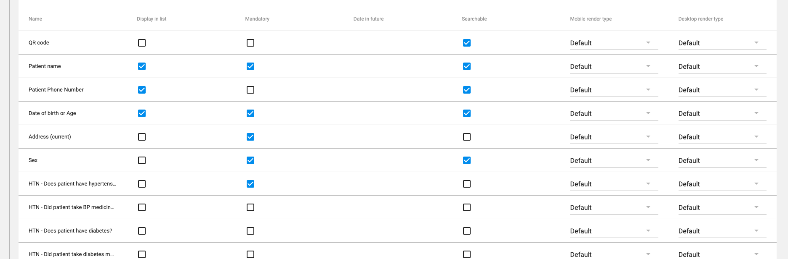
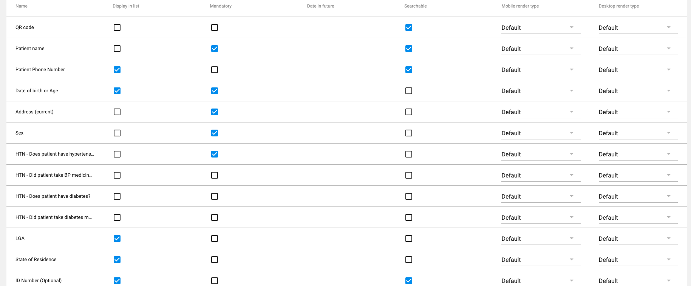
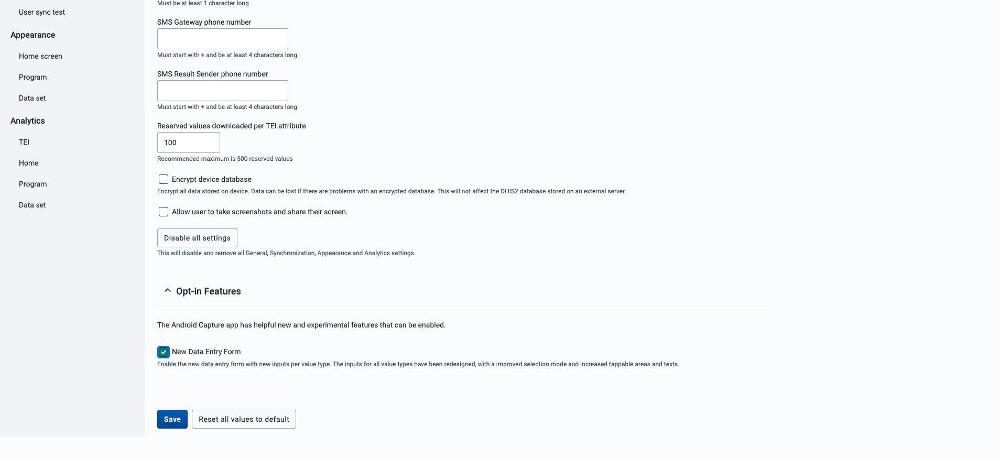
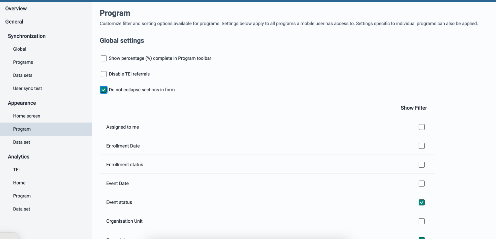
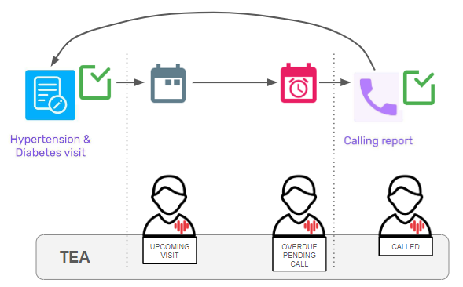
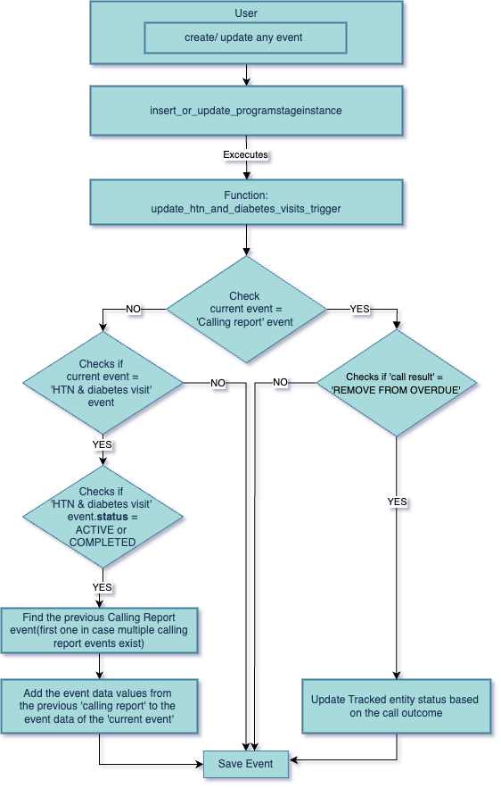

# DHIS2 Hypertension & Diabetes Package - Installation Guide { #ncd-htn-dm-installation }

## Installation

Installation of the package consists of several steps:

1. [Preparing](#preparing-the-metadata-file) the metadata file with DHIS2 metadata.
2. [Importing](#importing-metadata) the metadata file into DHIS2.
3. [Configuring](#additional-configuration) the imported metadata.
4. [Adapting](#adapting-the-tracker-program) the program after metadata import.

Read the entire guide before starting the installation and configuration process in DHIS2 as some sections of the guide may not be applicable (e.g. if you have an existing DHIS2 instance). When installing the package, first test installation in a test/staging environment before releasing on a production instance of DHIS2.

## Requirements

In order to install the package, an administrator user account on DHIS2 is required. Great care should be taken to ensure that the server itself and the DHIS2 application is well secured, to restrict access to the data being collected. Details on securing a DHIS2 system is outside the scope of this document, and we refer to the [DHIS2 documentation](https://docs.dhis2.org/).

## Preparing the metadata file

**NOTE**: If you are installing the package on a new instance of DHIS2, skip the “Preparing the metadata file” section and jump to the “[Importing a metadata file into DHIS2](#importing-metadata)” section.

While not always necessary, you may need to make modifications prior to importing the metadata file in DHIS2. Refer to the following sections for more info.

### Default data dimension

In older versions of DHIS2, the UID of the default data dimension was auto-generated. Thus, while all DHIS2 instances have a default category option, data element category, category combination and category option combination, the UIDs of these defaults can be different. In more recent versions of DHIS2, UIDs for the default dimensions are hardocded, and these UIDs are used in this configuration packages.

To avoid conflicts when importing the metadata, it is advisable to search and replace the entire .json file for all occurrences of these default objects, replacing UIDs of the .json file with the UIDs of the database in which the file will be imported. Table 1 shows the UIDs which should be replaced, as well as the API endpoints to identify the existing UIDs.

|Object|UID|API endpoint|
|--|--|--|
|Category|GLevLNI9wkl|.api/categories.json?filter=name:eq:default|
|Category option|xYerKDKCefk|.api/categoryOptions.json?filter=name:eq:default|
|Category combination|bjDvmb4bfuf|.api/categoryCombos.json?filter=name:eq:default|
|Category option combination|HllvX50cXC0|.api/categoryOptionCombos.json?filter=name:eq:default|

For example, if importing a configuration package into [https://play.dhis2.org/demo](https://play.dhis2.org/demo), the UID of the default category option combination could be identified through <https://play.dhis2.org/demo/api/categoryOptionCombos.json?filter=name:eq:default> as bRowv6yZOF2.

You could then search and replace all occurrences of HllvX50cXC0 with bRowv6yZOF2 in the .json file, as that is the default ID in the system you are importing the package into. 

**NOTE**: This search and replace operation must be done with a plain text editor, not a word processor like Microsoft Word.

### Indicator types

Indicator type is also an object that may lead to import conflicts because certain names are used in different DHIS2 databases (e.g. "Percentage"). Since indicator types is defined simply by their factor and whether or not they are simple numbers without a denominator, they are unambiguous and can be replaced through a search and replace of the UIDs. This avoids potential import conflicts, and avoids creating duplicate indicator types. The table below shows the UIDs which could be replaced, as well as the API endpoints to identify the existing UIDs.

|Object|UID|API endpoint|
|--|--|--|
|Numerator only (number)|kHy61PbChXr|.api/indicatorTypes.json?filter=number:eq:true&filter=factor:eq:1|
|Percentage|hmSnCXmLYwt|.api/indicatorTypes.json?filter=number:eq:false&filter=factor:eq:100|

### Tracked Entity Type

Similar to indicator types, you may have existing tracked entity types in your DHIS2 database. The references to the tracked entity type should be changed to reflect what is in your system so you do not create duplicates. The table below shows the UIDs which could be replaced, as well as the API endpoints to identify the existing UIDs.

|Object|UID|API endpoint|
|--|--|--|
|Person|MCPQUTHX1Ze|.api/trackedEntityTypes.json?filter=name:eq:Person|


### Visualizations using Root Organisation Unit

Visualizations, if included in a package, may contain a placeholder for a Root Organisation Unit. The placeholder label example is <OU_ROOT_UID>. Before attempting to import the package you need to replace this label with the UID of the Root Organisation Unit in your system.

## Importing metadata

The .json metadata file is imported through the [Import/Export](https://docs.dhis2.org/en/use/user-guides/dhis-core-version-master/maintaining-the-system/importexport-app.html) app of DHIS2. 

Use the "dry run" feature to test the import and identify issues with the import prior to the actual import. If the "dry run" leads to issues or conflicts, see the [import conflicts](https://who.dhis2.org/documentation/installation_guide_complete.html#handling-import-conflicts) section below. If the "dry run"/"validate" import works without error, import the metadata. If the import succeeds without any errors, proceed to [configure](https://who.dhis2.org/documentation/installation_guide_complete.html#configuration) the module. 

In some cases, import conflicts or issues are not shown during the "dry run", but appear when the actual import is attempted. In this case, the import summary will list any errors that need to be resolved.

**NOTE**: If you are importing the package into a new DHIS2 instance, you will not have import conflicts, as the database is empty. Follow the instructions to import the metadata then please proceed to the “[Additional configuration](#additional-configuration)” section.

### Handling import conflicts

There are a number of different conflicts that may occur. The most common conflict is that there are metadata objects in the configuration package with a name, shortname and/or code that already exists in the target database. There are a couple of solutions to these problems, with different advantages and disadvantages. Select a solution that works depending on the type of object for which there is a conflict.

#### Solution 1

Rename the existing object in your DHIS2 database for which there is a conflict. The advantage of this approach is that there is no need to modify the .json file, as changes are instead done through the user interface of DHIS2. This is likely to be less error prone. It also means that the configuration package is left as is, which can be an advantage for example when training material and documentation based on the configuration package will be used.

#### Solution 2

Rename the object for which there is a conflict in the .json file. The advantage of this approach is that the existing DHIS2 metadata is left as-is. This can be a factor when there is training material or documentation such as SOPs of data dictionaries linked to the object in question, and it does not involve any risk of confusing users by modifying the metadata they are familiar with.

**Note:** that for both Solutions 1 and 2, the modification can be as simple as adding a small pre/post-fix to the name, to minimise the risk of confusion.

#### Solution 3

A more complicated approach is to modify the .json file to re-use existing metadata. For example, in cases where an option set already exists for a certain concept (e.g. "sex"), that option set could be removed from the .json file and all references to its UID replaced with the corresponding option set already in the database. The big advantage of this (which is not limited to the cases where there is a direct import conflict) is to avoid creating duplicate metadata in the database. There are some key considerations to make when performing this type of modification:

* it requires expert knowledge of the detailed metadata structure of DHIS2.
* the approach does not work for all types of objects. In particular, certain types of objects have dependencies which are complicated to solve in this way, for example related to disaggregations.
* future updates to the configuration package will be complicated.

## Additional configuration

Once all the metadata in the package has successfully imported, there are a few more steps before the module is functional.

### Sharing

First, you will have to use the *Sharing* functionality of DHIS2 to configure which users (user groups) should see the metadata and data associated with the programme as well as who can register/enter data into the program. By default, sharing has been configured for the following:

* Tracked entity type
* Program
* Program stages
* Dashboards

There are three user groups that come with the package:

* HTN access
* HTN admin
* HTN data capture

By default the following is assigned to these user groups

|Object|User Group|||
|--|--|--|--|
||_Access_|_Admin_|_Data capture_|
|_*Tracked entity type*_|Metadata : can view <br> Data: can view|Metadata : can edit and view <br> Data: can view|Metadata : can view <br> Data: can capture and view|
|_*Program*_|Metadata : can view <br> Data: can view|Metadata : can edit and view <br> Data: can view|Metadata : can view <br> Data: can capture and view|
|_*Program Stages*_|Metadata : can view <br> Data: can view|Metadata : can edit and view <br> Data: can view|Metadata : can view <br> Data: can capture and view|
|_*Dashboards*_|Metadata : can view <br> Data: can view|Metadata : can edit and view <br> Data: can view|Metadata : can view <br> Data: can view|


You will want to assign your users to the appropriate user group based on their role within the system. You may want to enable sharing for other objects in the package depending on your set up. Refer to the [DHIS2 Documentation](https://docs.dhis2.org/en/use/user-guides/dhis-core-version-master/configuring-the-system/about-sharing-of-objects.html) for more information on configuring sharing.

### User Roles

Users will need user roles in order to engage with the various applications within DHIS2. The following roles are recommended:

1. Tracker data analysis : Can see event analytics and access dashboards, event reports, event visualizer, data visualizer, pivot tables, reports and maps.
2. Tracker data capture : Can add data values, update tracked entities, search tracked entities across org units and access tracker capture.

Refer to the [DHIS2 Documentation](https://docs.dhis2.org) for more information on configuring user roles.

### Organisation Units

You must assign the program to organisation units within your own hierarchy in order to be able to see the program in DHIS2 Android app or DHIS2 Capture web app.

### Duplicated metadata

**NOTE**: This section only applies if you are importing the package into a pre-existing DHIS2 database with metadata.

Even when metadata has been successfully imported without any import conflicts, there can be duplicates in the metadata - data elements, tracked entity attributes or option sets that already exist. As noted in the section above on resolving conflicts, an important issue to keep in mind is that decisions on making changes to the metadata in DHIS2 also needs to take into account other documents and resources that are associated with the existing metadata, and the metadata that has been imported through the package. Resolving duplicates is thus not only a matter of "cleaning up the database", but also making sure that this is done without, for example, breaking potential integrations with other systems, the possibility to use training material, breaking SOPs etc. This will very much be context-dependent.

One important thing to keep in mind is that DHIS2 has tools that can hide some of the complexities of potential duplications in the metadata. For example, where duplicate option sets exist, they can be hidden for groups of users through [sharing](https://docs.dhis2.org/en/use/user-guides/dhis-core-version-master/configuring-the-system/about-sharing-of-objects.html).

### Manual Changes in UI

After importing the metadata package, some manual changes are required in the DHIS2 user interface. Follow these steps to complete the configuration:

##### 1. Maintenance App

###### 1.1 Configure TEI Card and Details

1. Navigate to: Maintenance > Program > Hypertension & Diabetes > Attributes
2. Ensure the name is visible in the TEI card and details


###### 1.2 Limit Searchable TEAs

1. Navigate to: Maintenance > Program > Hypertension & Diabetes > Attributes
2. Limit searchable Tracked Entity Attributes to:
   - QR code
   - Patient name
   - Phone number


###### 1.3 Hide Schedule for Calling Report

1. Navigate to: Maintenance > Program > Hypertension & Diabetes > Calling report
2. Check the box for "Hide due date" to prevent scheduling new events for the calling report program stage

##### 2. Android App Settings

If required, install the Android App Settings app from the app management hub.

###### 2.1 Configure Latest Data Entry Form

1. Navigate to: General settings > Opt-In Features
2. Enable the "New data entry form" for the latest form UI


###### 2.2 Show All Sections in Form

1. Navigate to: Appearance > Program
2. Uncheck "Show percentage (%) complete in Program toolbar"
3. Enable "Do not collapse sections in form" to show all sections


By completing these manual changes, you'll ensure that the user interface is configured for the Hypertension & Diabetes program, improving usability and data entry efficiency for care providers.

##### Working Lists

Due to an error encountered during the import process using the import/export application, it was not possible to include the working lists in the JSON file. As a result, users need to create these working lists manually through the user interface. This section provides guidance on creating the necessary working lists based on their JSON equivalents. If you have access to the database, you can actually create them using the SQL script [here](https://github.com/simpledotorg/dhis2-hypertension-package/blob/main/scripts/create_overdue_working_lists.sql)

Please create the following working lists:

1. **Overdue - 1. Pending to call**
   - Filter criteria:
     - Patient status: ACTIVE
     - Hypertension status: Yes
     - Patient follow-up status: Overdue Pending Call

2. **Overdue - 2. Agreed to visit**
   - Filter criteria:
     - Patient status: ACTIVE
     - Hypertension status: Yes
     - Patient follow-up status: Called
     - Program stage filter: Calling report
        - Result of call: Agreed to visit
          
3. **Overdue - 3. Remind to call later**
   - Filter criteria:
     - Patient status: ACTIVE
     - Hypertension status: Yes
     - Patient follow-up status: Called
     - Program stage filter: Calling report
        - Result of call: Remind to call later

4. **Overdue - 4. Remove from list**
   - Filter criteria:
     - Patient status: ACTIVE
     - Hypertension status: Yes
     - Patient follow-up status: Called
     - Program stage filter: Calling report
        - Result of call: Remove from overdue

5. **Overdue patients**
   - Filter criteria:
     - Patient status: ACTIVE
     - Hypertension status: Yes
     - Event status: OVERDUE

When creating these working lists, ensure that the appropriate attributes, data elements, and program stages are selected to match the filter criteria described above. The exact configuration may vary depending on your specific DHIS2 instance and program structure.

For reference, the JSON equivalent of these working lists is provided below. Note that you cannot directly import this, but it can serve as a guide for the structure and criteria of each working list:

```json
{
  "programStageWorkingLists": [
    {
      "name": "Overdue - 1. Pending to call",
      "program": {
        "id": "pMIglSEqPGS"
      },
      "programStage": {
        "id": "anb2cjLx3WM"
      },
      "programStageQueryCriteria": {
        "eventOccurredAt": {
          "startBuffer": -60,
          "endBuffer": 0,
          "type": "RELATIVE"
        },
        "order": "createdAt:desc",
        "displayColumnOrder": [
          "sB1IHYu2xQT",
          "ENRjVGxVL6l",
          "YRDy9xy9jD0",
          "oindugucx72",
          "NI0QRzJvQ0k",
          "scheduledAt"
        ],
        "assignedUsers": [],
        "dataFilters": [],
        "attributeValueFilters": [
          {
            "attribute": "rgeuEnAI0nj",
            "in": [
              "OVERDUE_PENDING_CALL"
            ]
          },
          {
            "attribute": "jCRIT4GMMOS",
            "in": [
              "YES"
            ]
          },
          {
            "attribute": "fI1P3Mg1zOZ",
            "in": [
              "ACTIVE"
            ]
          }
        ]
      },
      "id": "UJ6ohaQ4S5X"
    },
    {
      "name": "Overdue - 2. Agreed to visit",
      "program": {
        "id": "pMIglSEqPGS"
      },
      "programStage": {
        "id": "W7BCOaSquMd"
      },
      "programStageQueryCriteria": {
        "eventOccurredAt": {
          "startBuffer": -60,
          "endBuffer": 0,
          "type": "RELATIVE"
        },
        "order": "createdAt:desc",
        "displayColumnOrder": [
          "sB1IHYu2xQT",
          "ENRjVGxVL6l",
          "oindugucx72",
          "NI0QRzJvQ0k",
          "YRDy9xy9jD0",
          "jCRIT4GMMOS",
          "fI1P3Mg1zOZ"
        ],
        "assignedUsers": [],
        "dataFilters": [
          {
            "dataItem": "q362A7evMYt",
            "in": [
              "AGREE_TO_VISIT"
            ]
          }
        ],
        "attributeValueFilters": [
          {
            "attribute": "fI1P3Mg1zOZ",
            "in": [
              "ACTIVE"
            ]
          },
          {
            "attribute": "jCRIT4GMMOS",
            "in": [
              "YES"
            ]
          }
        ]
      },
      "id": "KkcUsY8F5tK"
    },
    {
      "name": "Overdue - 3. Remind to call later",
      "program": {
        "id": "pMIglSEqPGS"
      },
      "programStage": {
        "id": "W7BCOaSquMd"
      },
      "programStageQueryCriteria": {
        "eventOccurredAt": {
          "startBuffer": -60,
          "endBuffer": 0,
          "type": "RELATIVE"
        },
        "order": "createdAt:desc",
        "displayColumnOrder": [
          "sB1IHYu2xQT",
          "ENRjVGxVL6l",
          "oindugucx72",
          "NI0QRzJvQ0k",
          "YRDy9xy9jD0",
          "jCRIT4GMMOS",
          "fI1P3Mg1zOZ"
        ],
        "assignedUsers": [],
        "dataFilters": [
          {
            "dataItem": "q362A7evMYt",
            "in": [
              "REMIND_TO_CALL_LATER"
            ]
          }
        ],
        "attributeValueFilters": [
          {
            "attribute": "fI1P3Mg1zOZ",
            "in": [
              "ACTIVE"
            ]
          },
          {
            "attribute": "jCRIT4GMMOS",
            "in": [
              "YES"
            ]
          }
        ]
      },
      "id": "g7YeCCkyj0N"
    },
    {
      "name": "Overdue - 4. Remove from list",
      "program": {
        "id": "pMIglSEqPGS"
      },
      "programStage": {
        "id": "W7BCOaSquMd"
      },
      "programStageQueryCriteria": {
        "order": "createdAt:desc",
        "displayColumnOrder": [
          "sB1IHYu2xQT",
          "ENRjVGxVL6l",
          "oindugucx72",
          "NI0QRzJvQ0k",
          "YRDy9xy9jD0",
          "jCRIT4GMMOS",
          "fI1P3Mg1zOZ"
        ],
        "assignedUsers": [],
        "dataFilters": [
          {
            "dataItem": "q362A7evMYt",
            "in": [
              "REMOVE_FROM_OVERDUE"
            ]
          }
        ],
        "attributeValueFilters": [
          {
            "attribute": "jCRIT4GMMOS",
            "in": [
              "YES"
            ]
          },
          {
            "attribute": "fI1P3Mg1zOZ",
            "in": [
              "ACTIVE"
            ]
          }
        ]
      },
      "id": "E1eBXuCAXUU"
    },
    {
      "name": "Overdue patients",
      "program": {
        "id": "pMIglSEqPGS"
      },
      "programStage": {
        "id": "anb2cjLx3WM"
      },
      "programStageQueryCriteria": {
        "eventStatus": "OVERDUE",
        "order": "createdAt:desc",
        "displayColumnOrder": [
          "sB1IHYu2xQT",
          "ENRjVGxVL6l",
          "oindugucx72",
          "NI0QRzJvQ0k",
          "YRDy9xy9jD0",
          "status",
          "scheduledAt",
          "createdAt",
          "jCRIT4GMMOS",
          "fI1P3Mg1zOZ"
        ],
        "assignedUsers": [],
        "dataFilters": [],
        "attributeValueFilters": []
      },
      "id": "IVpnpOgBdBq"
    }
  ]
}
```

By implementing these working lists, users will be able to efficiently manage and track overdue patients in various stages of follow-up within the hypertension program.


### Triggers for Tracked Entity Attribute Updates

#### Current Limitations in DHIS2

In the current DHIS2 implementation, Tracked Entity Attributes (TEAs) cannot be updated from a program stage. Program rules are limited to affecting data within their own context, typically within the form a user is working on. For instance, if a program rule is designed to assign a value to a TEA, the user would need to open the profile widget to trigger that program rule.

#### Database Trigger Workaround

To overcome this limitation, we've implemented a series of database triggers. These triggers update TEAs based on specific events in the system and can be found [here](https://github.com/simpledotorg/dhis2-hypertension-package/tree/main/scripts)
:

1. **Upcoming Visit Trigger**
   - Trigger name: update_teav_UPCOMING_VISIT_trigger_function
   - Activates when a new row for the "HTN visit" stage is inserted into the `programstageinstance` table with status SCHEDULE
   - Updates TEA to UPCOMING_VISIT

2. **Overdue Pending Call Trigger**
   - Trigger name: update_teav_OVERDUE_PENDING_CALL_trigger_function
   - Activates when a row for the "HTN visit" stage in the `programstageinstance` table is updated from SCHEDULE to OVERDUE status
   - Updates TEA to OVERDUE_PENDING_CALL
   - Note: This trigger is primarily useful with the Android app, which updates this status when syncing an overdue patient

3. **Called Status Trigger**
   - Trigger name: update_teav_CALLED_trigger_function
   - Activates when a new row for the "Calling report" stage is inserted into the `programstageinstance` table
   - Updates TEA to CALLED
   - Subsequent calls do not affect this TEA value

4. **Nightly Overdue Check Function**
   - Function name: update_overdue_pending_call_trigger_function
   - Executes nightly to check the due date of rows in `programstageinstance` where status = SCHEDULE
   - If due date > current date, updates TEA to OVERDUE_PENDING_CALL
   - To ensure this function runs automatically, a cron job needs to be set up:
     ```
     0 1 * * * psql -d dhis2 -f /path/to/overdue_check_function.sql
     ```
   - This cron job runs every night at 1:00 AM, executing the SQL function stored in the `overdue_check_function.sql` file on the DHIS2 database

    To install this cron job:

    1. Open the crontab file for editing:
      ```
      crontab -e
      ```

    2. Add the above line to the file, ensuring you replace `/path/to/overdue_check_function.sql` with the actual path to your SQL file.

    3. Save and close the file. The cron job is now installed and will run automatically.

    Note: Ensure that the user running the cron job has appropriate permissions to execute the SQL function on the DHIS2 database.
5. **Overdue patient updated in legacy data**
    - Function name: update_overdue_pending_call_for_existing_data_function
    - To be run only ONCE to update the TEA value to "OVERDUE_PENDING_CALL" of current overdue patients in your system

#### Benefits of This Approach

This solution addresses several key issues:

1. Resolves a Jira ticket regarding hiding/showing the Calling report stage
2. Improves functionality of overdue patients working lists
3. Enables showing the "Calling report" Program Stage for patients with TEA value OVERDUE_PENDING_CALL
4. Overcomes the limitation of filtering patients across different Program Stages

By storing patient status in a TEA, we can more easily manage complex scenarios, such as showing overdue patients who haven't been called, which was previously challenging due to data being spread across different Program Stages.



*Figure 1: Workflow diagram illustrating the database trigger process*

This approach significantly enhances the flexibility and functionality of patient management within the DHIS2 system, particularly for scenarios involving multiple program stages and complex status tracking.

### Trigger for managing overdue patient report in DHIS2

#### Current Limitations in DHIS2
In the current DHIS2 implementation, Program Indicator (PI) filter cannot perform cross program stage lookups.

#### Database Trigger Workaround
To overcome this limitation, we've implemented a database trigger that update the program stage of an overdue Tracked Entity Instance with the relevant data from another program stage.
- **Update HTN and Diabetes Visits Trigger**
  - Trigger name: insert_or_update_programstageinstance
  - Triggers when a new row is inserted/updated into the `programstageinstance` table
  - Adds the details from the previous "Calling report" event to the current "Htn and diabetes visit" event. The previous "Calling report" event has to be after the previous "Htn and diabetes visit" event.
  - The "Calling report" event corresponds to the first call made in the reporting month.

##### Setup
You will need to make some changes to the program stages inorder for the trigger to work as expected.

- Update the 'HTN and Diabetes Visits' program stage
  - Go to 'Assign data elements' section under the 'HTN and Diabetes Visits' program stage.
  - Add the following data elements from 'Calling report' program stage to 'HTN and Diabetes Visits' program stage:
    1. HTN - Result of call
    2. HTN - Reason for defaulting
    3. HTN - Date of first call
    4. HTN - Reason from overdue list because:
  - Save
- Run the script: [update-htn-and-diabetes-visits-trigger.sql](https://github.com/simpledotorg/dhis2-hypertension-package/blob/main/scripts/update-htn-and-diabetes-visits-trigger.sql) against your database.
- To be run only ONCE to create the trigger in your database.

#### Update legacy data
If you are already on an overdue management program and want to adapt our approach of reporting the data, use the below script to update your legacy data.
You can find the script in the 'scripts' folder in this repo. Details of the script are given below:
- **Update existing HTN & diabetes visits event with calling report event data**
  - Function name: update_htn_visits_and_ncd_patient_status_with_call_data

##### Setup
- Run the script:[update-htn-and-diabetes-visits-in-legacy-data.sql](https://github.com/simpledotorg/dhis2-hypertension-package/blob/main/scripts/update-htn-and-diabetes-visits-in-legacy-data.sql)
- To be run only ONCE to update the event data values of visits in your system.

#### Benefits of This Approach
Overcomes the limitation of filtering events across different Program Stages by bringing the data from two program stages to one program stage.
This allows us to compare the data from calling report event and visit event. This required to define overdue indicators.





### Aggregating Overdue Indicator Values

#### Current Limitation in DHIS2
In the current DHIS2 setup, using Program Indicators directly in the dashboards, with relatively large data sets, makes the data loading significantly slow. To overcome this limitation, for our Overdue dashboard we have implemented an SQL script to calculate the aggregate data asynchronously and populate related Data Elements. This way, since the values are precalculated we can make the dashboards load faster.

#### Setup
- If you have the package already running into the system, we need to first delete some of the values that were calculated with the previous approach of using Program Indicators. To do this, run the following command in your database.

   `DELETE FROM datavalue WHERE dataelementid = ( SELECT dataelementid FROM dataelement WHERE uid = 'X0pBiQ6SN5O')
      AND categoryoptioncomboid = (SELECT categoryoptioncomboid FROM categoryoptioncombo WHERE uid = 'HllvX50cXC0');`
   
   After this run the script [sql_agg_calculate_and_store-functions_and_procedure.sql
](https://github.com/simpledotorg/dhis2-hypertension-package/blob/main/scripts/sql_agg_calculate_and_store-functions_and_procedure.sql) in your database.

- If you are installing the fresh package, just run the script [sql_agg_calculate_and_store-functions_and_procedure.sql
](https://github.com/simpledotorg/dhis2-hypertension-package/blob/main/scripts/sql_agg_calculate_and_store-functions_and_procedure.sql) in your database.

- To ensure this scripts runs automatically, a cron job needs to be setup.
   Open the crontab file for editing using `crontab -e`.
   Add the following line to the file replacing user and schema with your corresponding configurations.
  
   `25 20 * * * psql -U[user] -d[schema] -c "call sql_agg_calculate_and_store();"`
  
   Save and close the file. The cron job is now installed and will run automatically at 8:25 PM every night on the database.


### Aggregate Data Exchange

## DHIS2 Aggregate Data Exchange Installation Guide

### Overview
This guide provides instructions for setting up aggregate data exchanges in DHIS2 using a provided JSON file. There are two aggregate data exchanges to be configured: one for the current period and one for previous periods.

### Aggregate Data Exchanges

1. **Current Period Exchange**
   - **Name**: ADEX - HTN DM - Current period
   - **ID**: tQ3bUoFoaSI
   - **Schedule**: This exchange should be scheduled to run on the first day of each month. It handles newly entered data for both monthly and quarterly periods (THIS_MONTH and THIS_QUARTER).
   - **Initial Run**: Manually run this exchange once after importing the JSON file.

2. **Previous Periods Exchange**
   - **Name**: ADEX - HTN DM - Previous periods
   - **ID**: ty6LYIC2aE5
   - **Schedule**: This exchange is intended to run only once after importing the JSON file. It generates legacy data for the last 12 months and 4 quarters (LAST_12_MONTHS, LAST_4_QUARTERS). Optionally, you can run it again if you perform any back data entry.

#### Configuration Steps

1. **Update the JSON File**:
    - Before importing the JSON file into DHIS2, open it with an editor.
    - Change the organization unit (OU) configuration for all requests, or use the Configuration option in the Exchange App after importing.

2. **Find and Replace Organization Unit Level UID**:
    - In the JSON file, locate all occurrences of `"LEVEL-xsXGrFxHbCN"`. This corresponds to the Org Unit Level = Facility in our development instance.
    - The Org Unit Level where data is being collected in your local context will have a different UID.

3. **Identify the Correct UID**:
    - To find out the UID you should use, make the following API call using GET:
      ```
      ..api/organisationUnitLevels?fields=id,name
      ```
    - Once you have identified the UID of your level, perform a search and replace ALL to update `xsXGrFxHbCN` to your UID in the entire JSON file.

4. **Import the JSON File**:
    - After making the necessary changes, proceed to import the JSON file into DHIS2.

#### Using the Aggregate Data Exchange App

When the data available in your instance is of a reasonable size, it might be possible to run these exchanges manually using the Aggregate Data Exchange application. 

Here is an example of how the exchange for previous periods will appear in the UI:


- Notice that there are four different requests for Hypertension and Diabetes, and for monthly and quarterly periods respectively. They can be seen in the tabs.

After clicking on **Submit**, you will get a confirmation screen similar to this:


Lastly, do not forget to run **Analytics Tables** to ensure that the dashboards show the latest aggregated data.

## Adapting the tracker program

Once the programme has been imported, you might want to make certain modifications to the programme. Examples of local adaptations that *could* be made include:

* Adding additional variables to the form.
* Adapting data element/option names according to national conventions.
* Adding translations to variables and/or the data entry form.
* Modifying program indicators based on local case definitions

However, it is strongly recommended to take great caution if you decide to change or remove any of the included form/metadata. There is a danger that modifications could break functionality, for example program rules and program indicators.
