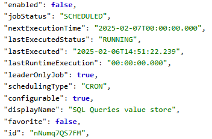
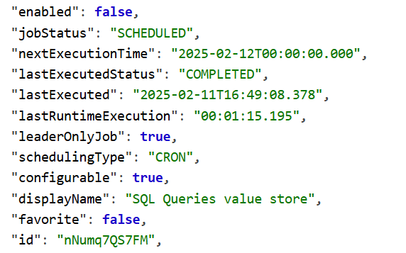
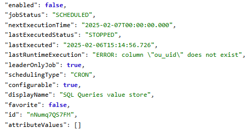

# SQL Aggregator: sql_agg_calculate_and_store

## **Overview**

### **Purpose**

The `sql_agg_calculate_and_store` procedure is designed to execute multiple aggregation functions dynamically, retrieve calculated values for different organization units over multiple time periods, and store the results in the `datavalue` table. Each function corresponds to a specific data element, ensuring that results are correctly mapped and stored for reporting purposes.

### **Functionality**

1. Iterates over a set of predefined **functions** and their corresponding **data elements**.

2. For each function, loops through the **last 13 months** to fetch data for each period.

3. Executes the function dynamically and retrieves **organization unit (OU) data**.

4. Stores or updates the calculated values in the `datavalue` table.

5. Tracks execution time and logs status updates in the `jobconfiguration` table.

6. Handles errors gracefully, ensuring that failures are logged properly.

## **Pre-requisites**

1. **Create a Lookup Table \
**This will store the **function names** and corresponding **data element UIDs**. \
sql \
CopyEdit \
`DROP TABLE IF EXISTS function_dataelement_map CASCADE;`

```
CREATE TABLE function_dataelement_map (
    id SERIAL PRIMARY KEY,       -- Auto-incrementing primary key
    de_uid VARCHAR(11) NOT NULL, -- Data element UID
    coc_uid VARCHAR(11) NOT NULL, -- COC UID (normally default)
    function_name TEXT NOT NULL   -- Function to execute
);


Example Insert: \
sql \
CopyEdit \
`INSERT INTO function_dataelement_map (de_uid, coc_uid, function_name)`

VALUES 
    ('MJCXX0UWxJP', 'HllvX50cXC0', 'contactable_overdue'),
    ('xZ07XCMF85u', 'mrScGGCsXxK', 'patients_returned_to_care_by_call_result_agreed'),
    ('xZ07XCMF85u', 'ObTBDRrMGXZ', 'patients_returned_to_care_by_call_result_remind'),
    ('xZ07XCMF85u', 'nBxYtHKrjAU', 'patients_returned_to_care_by_call_result_remove');
```
## **Code Breakdown & Explanation**

### **1. Procedure Definition & Variable Declarations**

### `CREATE`` ``OR`` ``REPLACE`` ``PROCEDURE`` ``sql_agg_calculate_and_store()`
`LANGUAGE`` ``plpgsql`
`AS`` ``$$`
```
DECLARE`    ``v_periodid`` ``BIGINT;`
`    ``v_dataelementid`` ``BIGINT;`
`    ``v_categoryoptioncomboid`` ``BIGINT;`
`    ``v_attributeoptioncomboid`` ``BIGINT;`
`    ``v_sourceid`` ``BIGINT;`
`    ``v_current_month`` ``TEXT;`
`    ``v_index`` ``INT;`
`    ``v_start_time`` ``TIMESTAMP;`
`    ``v_elapsed_time`` ``INTERVAL;`
`    ``v_elapsed_text`` ``TEXT;`
`    ``v_function_name`` ``TEXT;`
`    ``v_de_uid`` ``TEXT;`
`    ``v_coc_uid`` ``TEXT;`
`    ``rec`` ``RECORD;`
`    ``func_rec`` ``RECORD;`

```
**Explanation:**

- Declares variables for handling period IDs, data elements, category combos, org units, and time tracking.

- Captures function-related metadata (`v_function_name`, `v_de_uid`). \


- `v_start_time` records start of execution. \


### **2. Job Execution Status Update: **`RUNNING`

### ```
BEGIN`    ``v_start_time`` ``:=`` ``CLOCK_TIMESTAMP();`
`    ``UPDATE`` ``jobconfiguration`
`    ``SET`
`        ``lastupdated`` ``=`` ``NOW(),`
`        ``lastexecuted`` ``=`` ``NOW(),`
`        ``lastruntimeexecution`` ``=`` ``'00:00:00.000',`
`        ``lastexecutedstatus`` ``=`` ``'RUNNING'`
`    ``WHERE`` ``uid`` ``=`` ``'nNumq7QS7FM';`

```
**Explanation:**

- Captures the start timestamp.

- Updates `jobconfiguration` table to reflect the start of the job. \


### **3. Create Temporary Tables for Data Mapping**

### `    ``CREATE`` ``TEMP`` ``TABLE`` ``temp_orgunit_map`` ``AS`
`    ``SELECT`` ``uid`` ``AS`` ``ou_uid,`` ``organisationunitid`` ``FROM`` ``organisationunit;`
BLANK_LINE_FOUND_IN_GOOGLE_DOCS_2MD_PRO`    ``CREATE`` ``TEMP`` ``TABLE`` ``temp_period_map`` ``AS`
`    ``SELECT`` ``TO_CHAR(startdate,`` ``'YYYYMM')`` ``AS`` ``period_iso,`` ``periodid`
`    ``FROM`` ``period`
`    ``WHERE`` ``periodtypeid`` ``=`` ``(SELECT`` ``periodtypeid`` ``FROM`` ``periodtype`` ``WHERE`` ``name`` ``=`` ``'Monthly')`

**Explanation:**

- `temp_orgunit_map`: UID to internal ID mapping for org units. \


- `temp_period_map`: Maps periods in `YYYYMM` format to `periodid`. \


### **4. Fetch Static Values for Data Element Storage**

### `    ``SELECT`` ``categoryoptioncomboid`` ``INTO`` ``v_attributeoptioncomboid`` ``FROM`` ``categoryoptioncombo`` ``WHERE`` ``code`` ``=`` ``'default';`

**Explanation:**

- Retrieves default category option combo ID.


### **5. Outer Loop: Iterate Over Functions & Data Elements**

### `    ``FOR`` ``func_rec`` ``IN`
`        ``SELECT`` ``de_uid,`` ``coc_uid,`` ``function_name`` ``FROM`` ``function_dataelement_map`
`    ``LOOP`
`        ``v_de_uid`` ``:=`` ``func_rec.de_uid;`
`        ``v_coc_uid`` ``:=`` ``func_rec.coc_uid;`
`        ``v_function_name`` ``:=`` ``func_rec.function_name;`

**Explanation:**

- Loops through all function-data element mappings.

- Prepares variables for use in execution and data storage.


### **6. Middle Loop: Iterate Over the Last 13 Months**

### `        ``FOR`` ``v_index`` ``IN`` ``0..12`` ``LOOP`
`            ``v_current_month`` ``:=`` ``TO_CHAR((CURRENT_DATE`` ``-`` ``INTERVAL`` ``'1`` ``month'`` ``*`` ``v_index),`` ``'YYYYMM');`
BLANK_LINE_FOUND_IN_GOOGLE_DOCS_2MD_PRO`            ``SELECT`` ``periodid`` ``INTO`` ``v_periodid`` ``FROM`` ``temp_period_map`` ``WHERE`` ``period_iso`` ``=`` ``v_current_month;`

**Explanation:**

- Loops from current month back 12 months.

- Gets `periodid` for each month from temporary map. \


### **7. Inner Loop: Execute Function & Store Results**

### `            ``FOR`` ``rec`` ``IN`` ``EXECUTE`` ``FORMAT('SELECT`` ``ou_uid,`` ``ou_name,`` ``patient_count`` ``FROM`` ``%I($1,`` ``$2)',`` ``v_function_name)`` ``USING`` ``'monthly',`` ``v_current_month`
`            ``LOOP`
`                ``SELECT`` ``organisationunitid`` ``INTO`` ``v_sourceid`` ``FROM`` ``temp_orgunit_map`` ``WHERE`` ``ou_uid`` ``=`` ``rec.ou_uid;`
BLANK_LINE_FOUND_IN_GOOGLE_DOCS_2MD_PRO`                ``INSERT`` ``INTO`` ``datavalue`` ``(...)`
`                ``ON`` ``CONFLICT`` ``(...)`` ``DO`` ``UPDATE`` ``SET`` ``value`` ``=`` ``rec.patient_count,`` ``lastupdated`` ``=`` ``NOW();`

**Explanation:**

- Dynamically executes the aggregation function.

- Inserts or updates the result into the `datavalue` table. \


### **8. Job Completion and Performance Tracking**

### `    ``v_elapsed_time`` ``:=`` ``CLOCK_TIMESTAMP()`` ``-`` ``v_start_time;`
`    ``v_elapsed_text`` ``:=`` ``TO_CHAR(v_elapsed_time,`` ``'HH24:MI:SS.MS');`
BLANK_LINE_FOUND_IN_GOOGLE_DOCS_2MD_PRO`    ``UPDATE`` ``jobconfiguration`
`    ``SET`` ``lastupdated`` ``=`` ``NOW(),`` ``lastruntimeexecution`` ``=`` ``v_elapsed_text,`` ``lastexecutedstatus`` ``=`` ``'COMPLETED'`
`    ``WHERE`` ``uid`` ``=`` ``'nNumq7QS7FM';`

**Explanation:**

- Calculates and formats elapsed time.

- Updates job status to `COMPLETED` with runtime info. \


### **9. Error Handling: Logging Failures**

### ```
EXCEPTION`    ``WHEN`` ``OTHERS`` ``THEN`
`        ``v_elapsed_time`` ``:=`` ``CLOCK_TIMESTAMP()`` ``-`` ``v_start_time;`
`        ``v_elapsed_text`` ``:=`` ``TO_CHAR(v_elapsed_time,`` ``'HH24:MI:SS.MS');`
`        ``UPDATE`` ``jobconfiguration`
`        ``SET`` ``lastupdated`` ``=`` ``NOW(),`` ``lastruntimeexecution`` ``=`` ``v_elapsed_text,`` ``lastexecutedstatus`` ``=`` ``'STOPPED'`
`        ``WHERE`` ``uid`` ``=`` ``'nNumq7QS7FM';`
`        ``RAISE;`

```
**Explanation:**

- Catches errors during execution.

- Updates job status to `STOPPED` and records runtime. \


- Reraises error for external logging or monitoring.

## **Installation**

### **Install and Run the SQL File sql_agg_calculate_and_store-functions_and_procedure.sql Your PostgreSQL (PSQL) Database**

To install all the functions and procedures defined in the SQL file and run the queries:

**Open your terminal** and connect to your PostgreSQL database using `psql`: \
 \
`psql -U your_user_name -d your_database_name`

OR

**Run the SQL file** using the `\i` command: \
 \
`\i /full/path/to/sql_agg_calculate_and_store-functions_and_procedure.sql`

1.  Replace `/full/path/to/` with the actual path to your file. \


2. PostgreSQL will **create or replace** all the stored functions and procedures defined in the file. If successful, you'll see `CREATE FUNCTION` or `CREATE PROCEDURE` messages for each.

**Brief description of SQL functions and procedures included in the SQL file:**

| Name | Type | Description |
|---|---|---|
| puc | FUNCTION | Returns patients under care (PUC) in a given period. |
| contactable_overdue | FUNCTION | Returns patients overdue which have a phone number in a given period. |
| contactable_overdue_called_by_call_result | FUNCTION | Returns patients overdue with a phone number who were called, broken down by the result of that call, in a given period. |
| contactable_overdue_called_by_call_result_agreed | FUNCTION | Returns only the “Agreed to visit” result from contactable_overdue_called_by_call_result |
| contactable_overdue_called_by_call_result_remind | FUNCTION | Returns only the “Remind to call” result from contactable_overdue_called_by_call_result |
| contactable_overdue_called_by_call_result_remove | FUNCTION | Returns only the “Remove from overdue” result from contactable_overdue_called_by_call_result |
| contactable_overdue_called_by_call_result_unknown | FUNCTION | Returns only the “Unknown” result from contactable_overdue_called_by_call_result |
| patients_returned_to_care_by_call_result | FUNCTION | Returns patients overdue with a phone number who were called and returned to care within 15 days, broken down by the result of that call, in a given period. |
| patients_returned_to_care_by_call_result_agreed | FUNCTION | Returns only the “Agreed to visit” result from patients_returned_to_care_by_call_result |
| patients_returned_to_care_by_call_result_remind | FUNCTION | Returns only the “Remind to call” result from patients_returned_to_care_by_call_result |
| patients_returned_to_care_by_call_result_remove | FUNCTION | Returns only the “Remove from overdue” result from patients_returned_to_care_by_call_result |
| patients_returned_to_care_by_call_result_unknown | FUNCTION | Returns only the “Unknown” result from patients_returned_to_care_by_call_result |
| sql_agg_calculate_and_store | PROCEDURE | Stores aggregated results from all previous functions and for the period THIS_MONTH + LAST_12_MONTHS into the datavalue table. |

### **Create a monitoring Job for the aggregate script**

We need to create a monitoring job “SQL Queries value store” which will be used by the aggregate SQL script for maintaining the running status. It captures the last execution time and status of the sql aggregate procedure, and will also capture errors, if any, during the execution.

To create this job, please use the following curl command

```
curl -u "{{username}}:{{password}}" -X POST -H "Content-Type: application/json" -d '{
	"name": "SQL Queries value store",
	"jobType": "DATA_SYNC",
	"cronExpression": "0 0 0 ? * *",
	"enabled": false,
	"id": "nNumq7QS7FM"
}' "{{URL}}/api/jobConfigurations"
```
Before executing this command, please replace username, password and URL of the desired host location.

## **Execution**

Once the SQL functions and procedure have been created in the database, we need to create a cron job to make sure the aggregation takes place daily. An example as follows:

```
25 20 * * * psql -U[user] -d[schema] -c "call sql_agg_calculate_and_store();"
```
Please replace user and schema with your corresponding configurations

If required it can be run manually from the database console using the following command.

```
call sql_agg_calculate_and_store();
```
## **Monitoring**

As explained in the Installation section, we create a **new job as a placeholder**, which adds a new row to the `jobconfiguration` table. This serves as an entry to track the execution status of the `sql_agg_calculate_and_store()` procedure. Currently the uid for this job is `nNumq7QS7FM``.`

### **Job Execution Status**

When the `sql_agg_calculate_and_store()` procedure runs, it updates the job's status in the `jobconfiguration` table using the following states:

- `RUNNING` → The procedure has started execution.



- `COMPLETED` → The procedure finished successfully


.

- `STOPPED` → The procedure encountered an error or was terminated.



### **Accessing Execution Results**

Once executed, the job's results can be accessed via the DHIS2 API. Example:

bash

CopyEdit

```
curl -X GET -u admin:district "https://dhis2-sandbox1.simple.org/api/jobConfigurations/nNumq7QS7FM"
```
This returns details about the job, including its status and execution time (see screenshots above)

### **Clearing Cache Before API Call**

Before checking the job status, **clear the cache in PostgreSQL**, or the API might return outdated results. Use this command:

bash

CopyEdit

```
curl -X PUT -u admin:district "https://dhis2-sandbox1.simple.org/api/maintenance/cacheClear"
```
This ensures the latest execution results are visible.


Failed


Success
